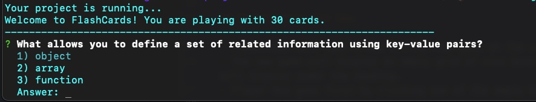
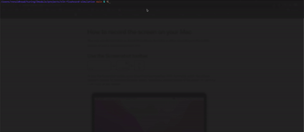

A GIF of the working application
Technologies used
Install/Setup instructions

# FlashCards Simulation

  

This project simulates a FlashCard game using the command line through the terminal. The game will house 30 card instantiations of Javascript-related questions pertaining to Turing's Module 2 FrontEnd curriculum. When the user runs this program, they can answer all 30 flashcard questions to test their knowledge! This particular project also contains 5 unit tests for each of the JS classes.

## Contributor
- [Ron Head](https://github.com/RonLHead)

## Technologies Used
- JavaScript

## [Deploy Link](https://github.com/RonLHead/rlh-flashcard-simulation)

## Instructions For Use

#### FlashCards Simulation

- To run the FlashCards simulation, the user will open index.js through the command line. Example would be node index.js.
- The user will see the text "Your project is running..."
  "Welcome to FlashCards! You are playing with 30 cards"
- In order to answer a question, the user will enter 1 to 3, which correspond to the 3 possible answers.
- After enter 1, 2, or 3, the user will click enter, which will record their answer.
- If the user is correct, they will see the text "Your answer of ____ is correct!", then they can click enter again to go the next question.
- If the user is incorrect, they will see the text "Your answer of ____ is incorrect!", then they can click enter again to go the next question.
- Once all the user has gone through all the FlashCards, the program ends.

#### Unit Tests

- This repo also includes 5 unit tests for the 5 JavaScript classes: Card, Deck, Turn, Round, and Game.
- To open one of these tests, the user can run the test in the command line by typing npm test test/<name-of-test.js>.
- All 5 unit tests should pass. The user can make changes to any of the corresponding JavaScript files if they wish to test or modify the program.

## Future Additions
- Implement an option for users to select from various decks of cards.
